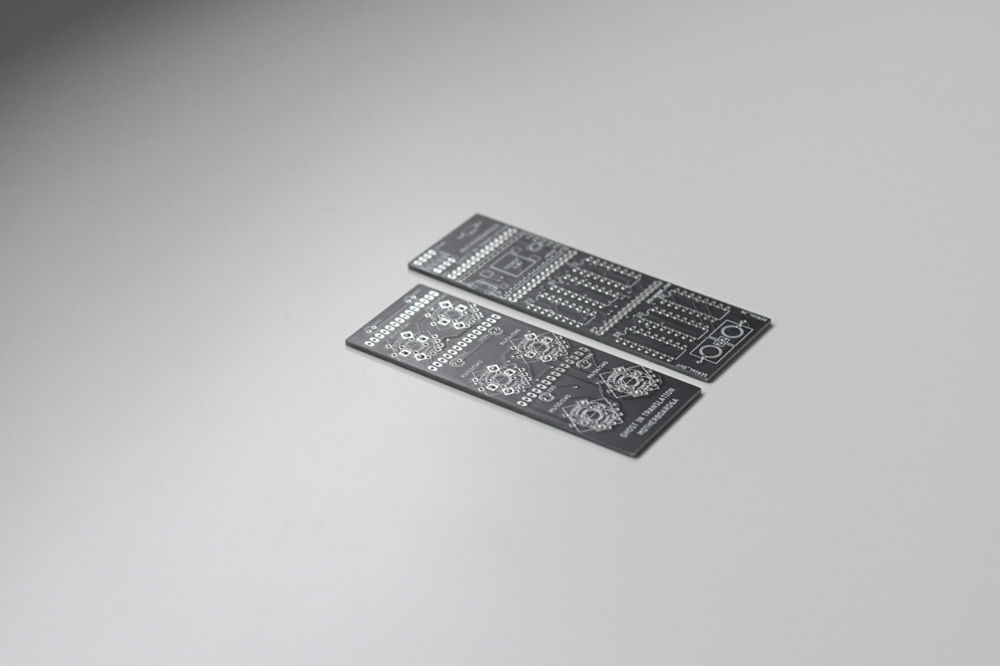
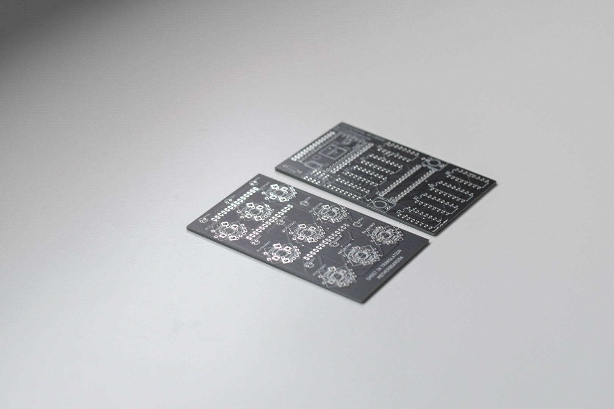
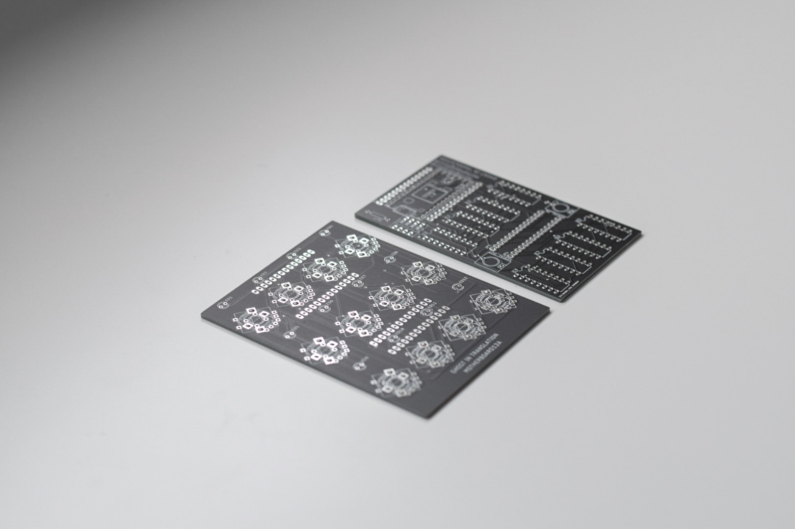
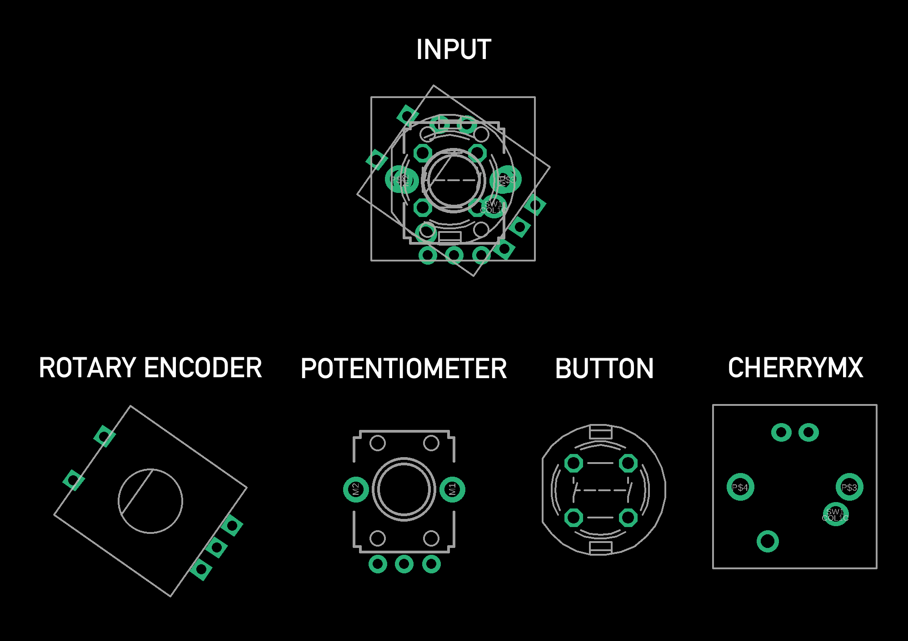
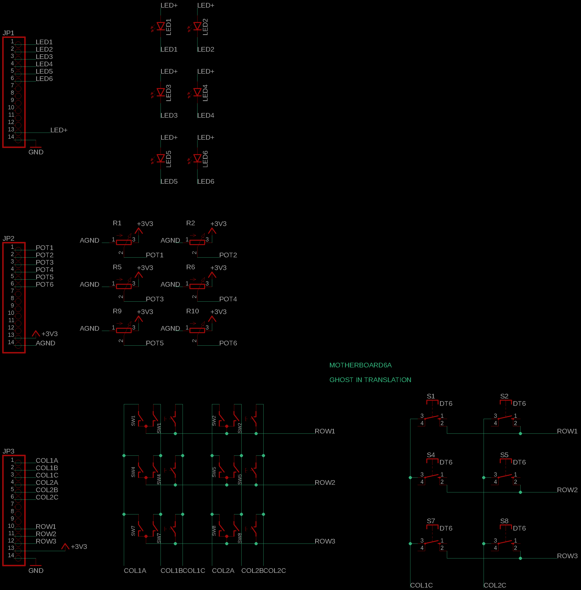
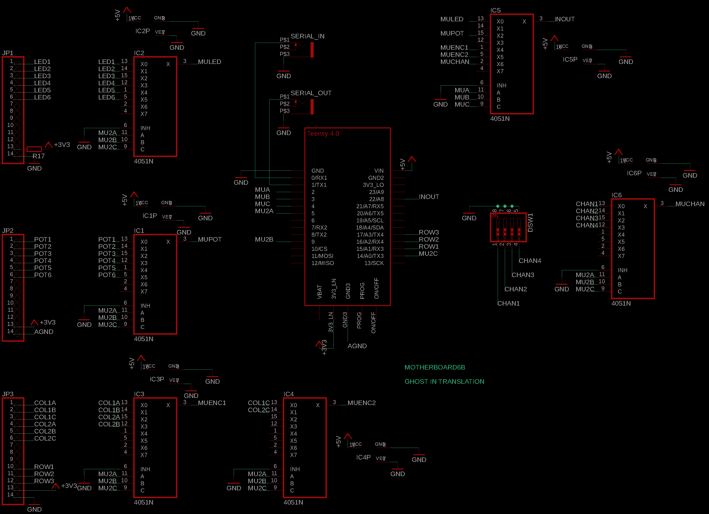
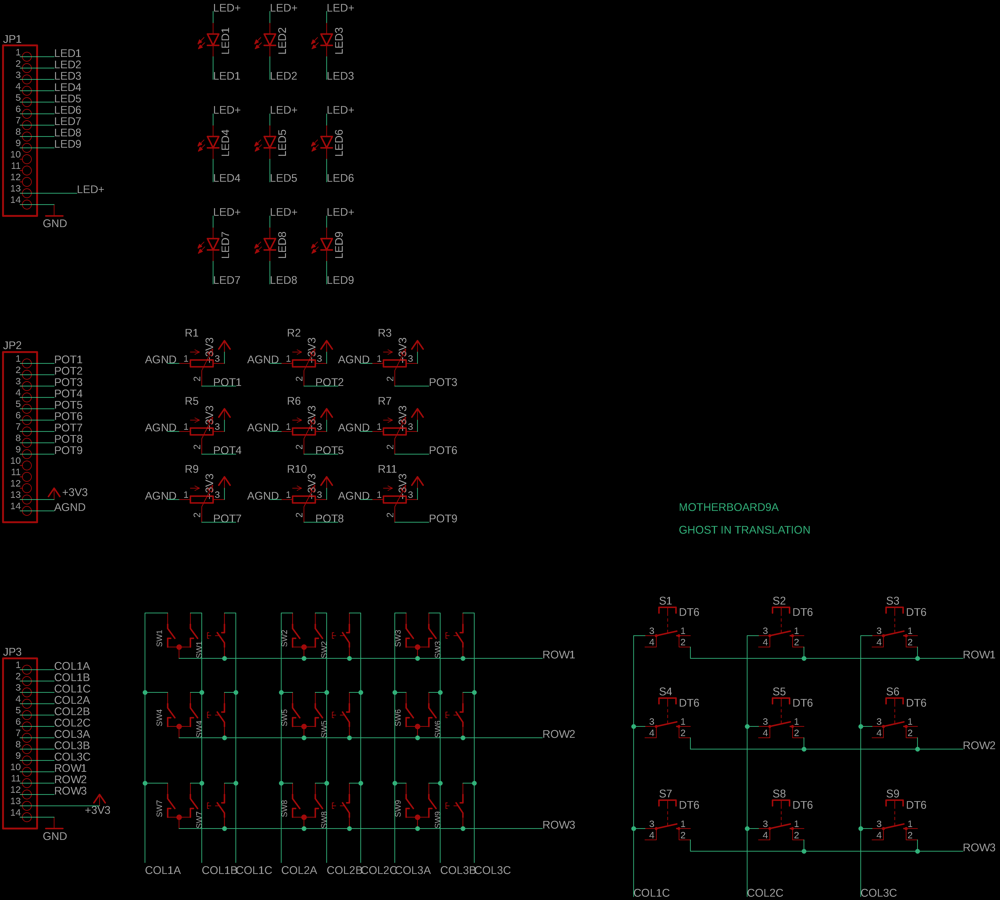
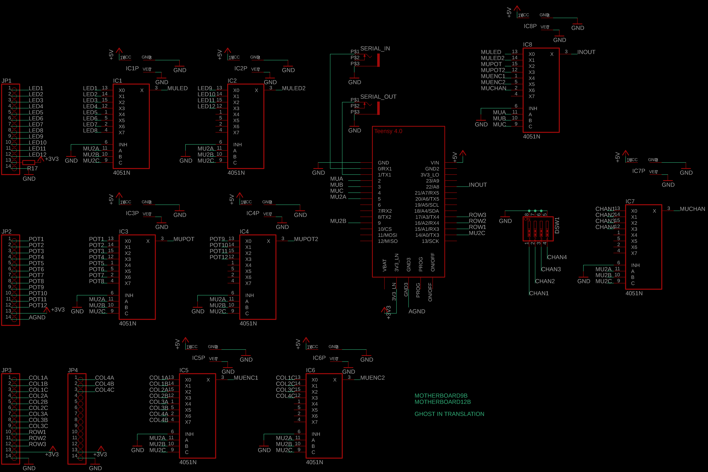
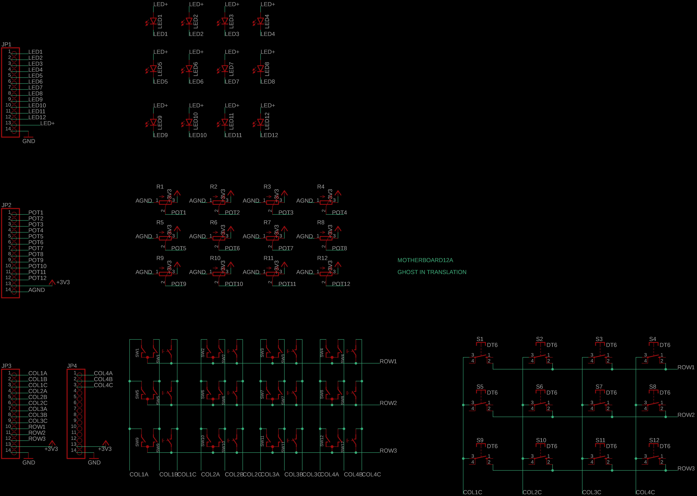
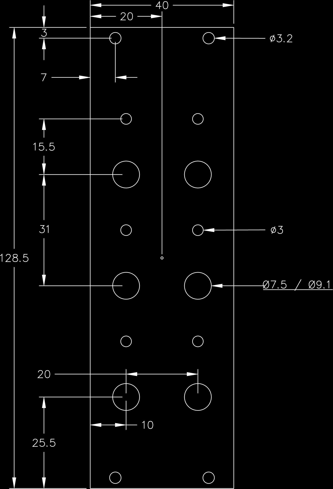

# MOTHERBOARD


**[PCBs AND MODULES AVAILABLE HERE](https://ghostintranslation.bandcamp.com/merch/)**

## Features

* Analog inputs (12 bits)
* Analog outputs (12 bits)
* Touchpads inputs (40 levels)
* MIDI via jacks
* MIDI via USB
* 10 pin Eurorack power
* USB power
* Simple programming
* Web editor config (coming soon)

## MOdular Teensy Hybrid Eurorack Board

MOTHERBOARD is a Teensy 4.0 modular platform that facilitates the creation of various modules ranging from synthesizers to sequencers. 

TODO: UPDATE THOSE PICTURES

It comes in 3 sizes:
* MOTHERBOARD6: 2 columns, 6 controls, 8 inputs and 8 outputs, 8HP  
  
* MOTHERBOARD12: 4 columns, 12 controls, 16 inputs and 16 outputs, 16HP  
  
* MOTHERBOARD24: 8 columns, 24 controls, 32 inputs and 32 outputs, 32HP  
  

TODO: ADD ASSEMBLED PICTURES

### Vocabulary

There is a distinction between controls and inputs. Controls are what is used to manipulate an input from the front panel like a potentiometer, a button or a jack. 

The MOTHERBOARD is composed of 3 PCBs that get stacked one on each other.  
A is the controls PCB, B is the main PCB, C is the optional back jacks PCB.

## Modularity

The MOTHERBOARD is a modular platform, not just because its intended use is modular music, but because its PCBs are designed to be modular. 

On PCB A, each control slot accepts a variety of controls, and each jack can be soldered to be either an input or an output. The supported type of controls are: Potentiometer, D6 Pushbutton, MX Key, SPDT Switch, SPST switch, Rotary Encoder.



On PCB B, DACs may be ommitted depending on the number of outputs used, and there is the choice of through hole or SMD packages. 

Finally, PCB C is optional and allows to connect modules from the back to avoid the spaghetti situation. 

Note: An optional expander is also available to access everything on the front.

## Design rules

The MOTHERBOARD follows a column design of 3 controls per column, and 4 jacks at the bottom of each column.

Each input is mapped to a control and a jack in order, from left to right and top to bottom. 

Each output is mapped to a jack in order, from left to right and top to bottom.

TODO: IMAGE HERE

## Inputs / Outputs

All inputs and ouputs are accessible from the PCB C. However because of limited space on the front panels, not all inputs and outputs are accessible on the PCB A (but they are all accessible via the jacks).

For instance, MOTHERBOARD6 features 2 columns, which means 6 controls and 8 jacks on the front panel. Inputs 1-6 are connected to controls and jacks 1-6. Inputs 7-8 are only connected to jacks 7-8. And Outputs 1-8 are connected to jacks 1-8.
 
Remember, each jack at the bottom can be soldered as either an input or an outpout. Because there is actually only 8 jacks on the front panel but there is 8 inputs + 8 outputs, half of them won't be accesible from the front panel but could be accessed from PCB C on the back. PCB C gives access to all 8 inputs and 8 outputs. 

### Inputs

Inputs support 0v to 5v, however in order to work well with the range of the outputs they are programmed to read 0v to 4.096v.

Inputs can be altered by the front controls as well as voltages coming from the front jacks and voltages coming from the back jacks. All 3 are connected in parallel on the corresponding input which results in the final value being the average of all incoming values.

However in the case of a potentiometer in place of the control, the potentiometer will act as an attenuator of the front jack voltage when it is plugged in. When the jack is not plugged in the potentiometer acts as a regular control.

TODO: TABLE OF ALL POSSIBLE INPUTS CONFIGURATIONS

### Outputs

Outputs are 12 bits true analog voltages provided by MCP4822 DACs. Their range is 0v to 4.095v. 

Each jack on PCB A can be soldered to be either an input or an output and all outputs can be access from PCB C. It is possible to use both the front and back jack of an output to send the signal to other modules.

## Schematics

TODO

### MOTHERBOARD6
<p>
 
</p>

### MOTHERBOARD9
<p>
 
</p>

### MOTHERBOARD12
<p>
 
</p>

### Notes

The MIDI input is going through an optocoupler and all inputs are going through an opamp, which both isolate the incoming signals from the Teensy, that means you won't risk frying it. Though if you send more than 5v in the jacks, although there is some tolerance it will fry the opamp at some point.

The VX7805-500 is a DC-DC switching voltage regulator which converts Eurorack's 12v to 5v while not producing any heat. This part can be replaced with a LM7805 which is a linear voltage regulator, however if you do that you will need a good heatsink because it will get burning hot, and you will probably have to bend it if you wish to also use PCB C behind.

If you are not using Eurorack power and only using USB you can avoid soldering D1, C1, C2, the regulator and the 10 pins connector.

If you are not using MIDI you can avoid soldering D4 but you will still need the dipswitch, it provides a way to run the calibration mode in order to get the best experience.

## Bill Of Materials

Here is the list of components you will need:

TODO

```
1 MOTHERBOARD PCB A
1 MOTHERBOARD PCB B
1 MOTHERBOARD PCB C (optional)
1 Teensy 4.0
1 Teensy audio board Rev D (optional)
2 14 pins female headers
x female round pins headers or DIP 16 and DIP8 IC sockets
x male header
x 2 rows long female header 
4 2N4007 diodes
1 4 positions dipswitch (optional)
x CD4051 chips
x CD4053 chips
x 74HC596 chips
x MCP4822 chips
x 3.5mm TR jack connectors
x LEDs
x Vertical linear 10k potentiometers
x Vertical rotary encoders
x D6 pushbuttons
```

TODO: Update this list
Here is a list of useful links to get these parts: https://github.com/ghostintranslation/parts

## Teensy

In order to run any sketch on the Teensy you have to install Arduino and the Teensyduino add-on.
Follow the instructions from the official page:
https://www.pjrc.com/teensy/teensyduino.html

1. Then open `Motherboard.ino` located in the `Motherboard` folder of this repo.
2. In the Tools -> USB Type menu, choose `Serial + midi`.
3. Plug the Teensy to your computer with a micro USB cable. (It's ok if the Teensy is on the module)
4. Then just click the arrow button to upload the code

## How to use

Copy the `Motherboard.h` file in your project. Then just include it and start using it.

### Init

Motherboard is a singleton, there can be only one instance. This is how to initialize it:

```
Motherboard * motherboard;

void setup() {
  motherboard = Motherboard::init(
    "Motherboard",
    {
      Potentiometer, Potentiometer,
      Potentiometer, Potentiometer,
      Potentiometer, Potentiometer
    }
  );
}
```
The first parameter is the name of the module. This will show in the MIDI web editor.

The second parameter is the list of inputs. Potentiometer, Button, RotaryEncoder are valid values.

Then you have to call the Motherboard's `update`:
```
void loop() {
  motherboard->update();
}
```

### LEDs

LEDs are controlled by setting their status according to:

- 0 = Off
- 1 = Solid
- 2 = Slow flashing
- 3 = Fast flashing
- 4 = Solid for 50 milliseconds
- 5 = Solid low brightness

#### Set one LED:
```
void setLED(byte ledIndex, byte ledStatus);
```

#### Set multiple LEDs:
The first parameter called `binary` is a number that will be represented in binary with the least significant bit on the left. Ex: 9 = 100100 => LEDs of indexes 0 and 3 will be lit.
```
void setAllLED(unsigned int binary, byte ledStatus);
```

#### Toggle an LEDs:
```
void toggleLED(byte index);
```

#### Reset all LEDs:
```
void resetAllLED();
```

### Inputs

#### Get one input value:
- In the case of a potentiometer it will return between 0 and the max analog resolution which is 1023 by default.
- In the case of a button it will return 1 for push 0 for release.
- In the case of a rotary it will return the number of rotations since the last get.
```
int getInput(byte index);
```

#### Get the switch value of an encoder:

Because an encoder is like 2 controls, the rotary and the switch, we need this function in addition to `getInput`.
```
int getEncoderSwitch(byte index);
```

#### Get the maximum possible value of the potentiometers:
The value depends of the ADC resolution, which is 10 by default and can be set to 12 or 8.

With a resolution of 10 bits, the maximum value is 1023.
```
int getAnalogMaxValue();
```

#### Get the minimum possible value of the potentiometers:
It should always be 0, but if your potentiometers are not that accurate they could return bigger than 0 as a minimum value. You could then change the return value of that function to match the real minimum. This will ensure that `getInput` always returns a minimum of 0 and a maximum of 1023 that corresponds to the actual min and max. 
```
int getAnalogMinValue();
```

#### Get the midi channel
This is set by the dipswitch and read only once when powered on. If no dipswtich is soldered then the channel will be 1.
```
byte getMidiChannel();
```

### Callbacks
Callbacks are a very good way of handling inputs. Using them instead of reading `getInput` in the loop will make your code easier to read and maintain.

#### setHandlePressDown

Callback will be called on a press of a button

```
/**
 * Handle press down on a button
 * @param inputIndex The index of the input
 * @param fptr The callback function, void (*)(byte inputIndex)
 */
void setHandlePressDown(byte inputIndex, PressDownCallback fptr);
```

#### setHandleLongPressDown

Callback will be called on a long press of a button

```
/**
 * Handle long press down on a button
 * @param inputIndex The index of the input
 * @param fptr The callback function, void (*)(byte inputIndex)
 */
void setHandleLongPressDown(byte inputIndex, LongPressDownCallback fptr);
```

#### setHandlePressUp

Callback will be called at release of a button.

```
/**
 * Handle press up on a button
 * @param inputIndex The index of the input
 * @param fptr The callback function, void (*)(byte inputIndex)
 */
void setHandlePressUp(byte inputIndex, PressUpCallback fptr);
```

#### setHandleLongPressUp

Callback will be called at release after a long press of a button.

```
/**
 * Handle long press up on a button
 * @param inputIndex The index of the input
 * @param fptr The callback function, void (*)(byte inputIndex)
 */
void setHandleLongPressUp(byte inputIndex, LongPressUpCallback fptr);
```

#### setHandlePotentiometerChange

Callback will be called on a change of a potentiometer.

```
/**
 * Handle potentiometer change
 * @param inputIndex The index of the input
 * @param fptr The callback function, void (*)(byte inputIndex, float value, int diffToPrevious)
 */
void setHandlePotentiometerChange(byte inputIndex, PotentiometerChangeCallback fptr);
```

#### setHandleRotaryChange

Callback will be called on a rotation of a rotary encoder.

```
/**
 * Handle rotary change
 * @param inputIndex The index of the input
 * @param fptr The callback function, void (*)(byte inputIndex, bool value)
 */
void setHandleRotaryChange(byte inputIndex, RotaryChangeCallback fptr);
```

### MIDI callbacks
Callbacks also exist for some MIDI messages.

Note, setting a callback on channel 0 means it is going to be triggered on messages addressed to the channel set by the dipswitch on the board. Otherwise channel is from 1 to 16.

#### setHandleMidiNoteOn

Callback triggered on MIDI note on message.

```
/**
 * Handle MIDI note on
 * @param fptr The callback function, void (*)(byte channel, byte note, byte velocity)
 */
void setHandleMidiNoteOn(MidiNoteOnCallback fptr);
```

#### setHandleMidiNoteOff

Callback triggered on MIDI note off message.

```
/**
 * Handle MIDI note off
 * @param fptr The callback function, void (*)(byte channel, byte note, byte velocity)
 */
void setHandleMidiNoteOff(MidiNoteOffCallback fptr);
```

#### setHandleGlobalMidiControlChange

Callback triggered on any MIDI Control Change messages, not depending on the channel nor the control number.

```
/**
 * Handle MIDI global control change
 * @param fptr The callback function, void (*)(byte channel, byte control, byte value)
 */
void setHandleGlobalMidiControlChange(GlobalMidiControlChangeCallback fptr);
```

#### setHandleMidiControlChange

Callback triggered on MIDI Control Change messages addressed to the channel set on the board.

```
/**
 * Handle MIDI control change
 * @param control The control number
 * @param controlName The name of the control
 * @param fptr The callback function, void (*)(byte channel, byte control, byte value)
 */
void setHandleMidiControlChange(byte control, String controlName, MidiControlChangeCallbackFunction fptr);
```

#### setHandleMidiControlChange

Callback triggered on MIDI Control Change messages.

```
/**
 * Set handle MIDI control change
 * @param channe; The channel number
 * @param control The control number
 * @param controlName The name of the control
 * @param fptr The callback function, void (*)(byte channel, byte control, byte value)
 */
void setHandleMidiControlChange(byte midiChannel, byte control, String controlName, MidiControlChangeCallbackFunction fptr);
```

#### setHandleMidiSysEx

Callback triggered on MIDI SysEx messages.

```
/**
 * Set handle MIDI SysEx
 * @param fptr The callback function, void (*)(const uint8_t* data, uint16_t length, bool last)
 */
void setHandleMidiSysEx(MidiSysExCallback fptr);
```

## Design rules

Here are the dimensions for any module size. Every column is following the same rules. So the size of a module depends on the number of column. 2 columns = 2x20mm = 40mm, 3 columns = 3x20 = 60mm ...



# About me
You can find me on Bandcamp, Instagram, Youtube and my own site:

https://ghostintranslation.bandcamp.com/

https://www.instagram.com/ghostintranslation/

https://www.youtube.com/channel/UCcyUTGTM-hGLIz4194Inxyw

https://www.ghostintranslation.com/

# Support
To support my work:<br>
https://www.paypal.com/paypalme/ghostintranslation

# License

This project is licensed under the MIT License - see the [LICENSE.md](LICENSE.md) file for details