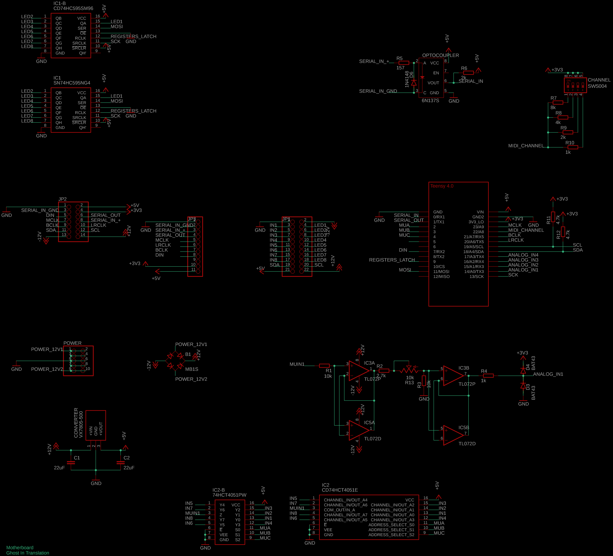

# THIS IS A WIP

# MOTHERBOARD


**[PCBs AND MODULES AVAILABLE HERE](https://ghostintranslation.bandcamp.com/merch/)**

## Features

* 8 analog inputs (12 bits, 5v, 44.1kHz)
* 8 leds outputs
* 2 audio channels over I2S or 8 channels over TDM
* I2C to expand with analog outs and more
* MIDI in and out
* 10 pin Eurorack either way power
* Through hole and SMD footprints for most of the chips
* Simple programming

## Introduction

Wether analog or digital, often modules are designed from scratch as one-offs creations. This means going through the same challenges and solving them in slightly different ways. It’s possible to do better and not reinvent the wheel every time. 

By separating the functional circuitry from the user interface circuitry, a pattern will emerge and make it possible to reuse at least a few things. 

With analog it is more difficult to achieve as the circuit is very much dependent on the  inputs and outputs, but it would still be possible to have a generic user interface connected to a specific functional circuit. 

With digital this gets interesting. The functional circuit can be completely generic and be reused for many modules, simply reading inputs and generating outputs, it doesn’t need to be designed around the final module. The low level code can be generic and reused too, while the high level code would be specific to each module. 

## Hardware

- Photos of Motherboard with labels

### Schematics



### Bill Of Materials

```
Part        Value             Device            Package                   

B1          MB1S              MB1S              SOIC-4                     
C1,C2       22uF              C-EU025-024X044   C025-024X044             
D3,D4       BAT43             DIODE-D-2.5       D-2.5                      
D6          1N4148            DIODE-D-2.5       D-2.5                      
IC1         SN74HC595NG4      SN74HC595NG4      DIP794W53P254L1930H508Q16N 
IC1-B       CD74HC595SM96     CD74HC595SM96     SOP65P780X200-16N          
IC2         CD74HCT4051E      CD74HCT4051E      DIP794W53P254L1930H508Q16N 
IC2-B       74HCT4051PW       74HCT4051PW       SOP65P640X110-16N          
IC3         TL072P            TL072P            DIL08                      
IC5         TL072D            TL072D            SO08                         
R1,R3       10k               R-EU_0204/2V      0204V                      
R2          2.7k              R-EU_0204/2V      0204V                      
R4,R10      1k                R-EU_0204/2V      0204V                      
R5          157               R-EU_0204/2V      0204V                      
R6,R9       2k                R-EU_0204/2V      0204V                      
R7          8k                R-EU_0204/2V      0204V                      
R8          4k                R-EU_0204/2V      0204V                      
R11,R12     4.7k              R-EU_0204/2V      0204V                      
R13         10k               TRIM_US-PT-10     PT-10                                 
CHANNEL     SWS004            SWS004            SMS-004                    
CONVERTER   VX7805-500        VX7805-500        VX7805500                       
OPTOCOUPLER 6N137S            6N137S            8-SMD                      
JP1                           PINHD-2X11        2X11                       
JP2                           PINHD-2X7         2X07                       
JP3                           PINHD-1X11        1X11                       
POWER                         PINHD-2X5         2X05      
U$1         TEENSY 4.0        TEENSY 4.0        TEENSY 4.0
```

### Teensy

In order to run any sketch on the Teensy you have to install the Arduino IDE. Follow the instructions from the official page, section "Arduino 2.0.x Software Development": https://www.pjrc.com/teensy/td_download.html

1. Then open Motherboard.ino located in the firmaware/example folder of this repo.
2. In the Tools -> USB Type menu, choose Serial.
3. **Make sure the Motherboard is not powered with external power when pluggin Teensy to a computer!**
3. Plug the Teensy to your computer with a micro USB cable.
4. Then just click the arrow button to upload the code

## Firmware

## How to 
## TODO
- See if possible to create an expander that attaches to the back
- Actually implement the MIDI Input
- Final check of the MIDI hardware
- Rewire the op amp to be powered by 5v, footprint for mcp6292
- Can Tx detect If MIDI or CLK type of signals
- How to Teletype I2C compatibility
- Web editor to edit settings and maybe visualize data


# About me
You can find me on Bandcamp, Instagram, Youtube and my own site:

https://ghostintranslation.bandcamp.com/

https://www.instagram.com/ghostintranslation/

https://www.youtube.com/ghostintranslation

https://www.ghostintranslation.com/

# Support
To support my work:<br>
https://www.patreon.com/ghostintranslation
https://www.paypal.com/paypalme/ghostintranslation
https://www.buymeacoffee.com/ghostintranslation

# License

This project is licensed under the MIT License - see the [LICENSE.md](LICENSE.md) file for details