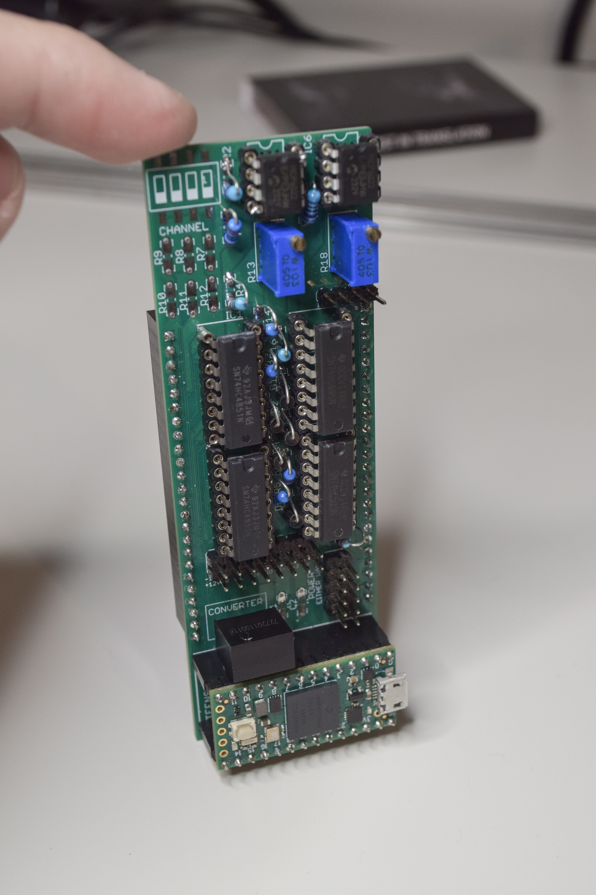
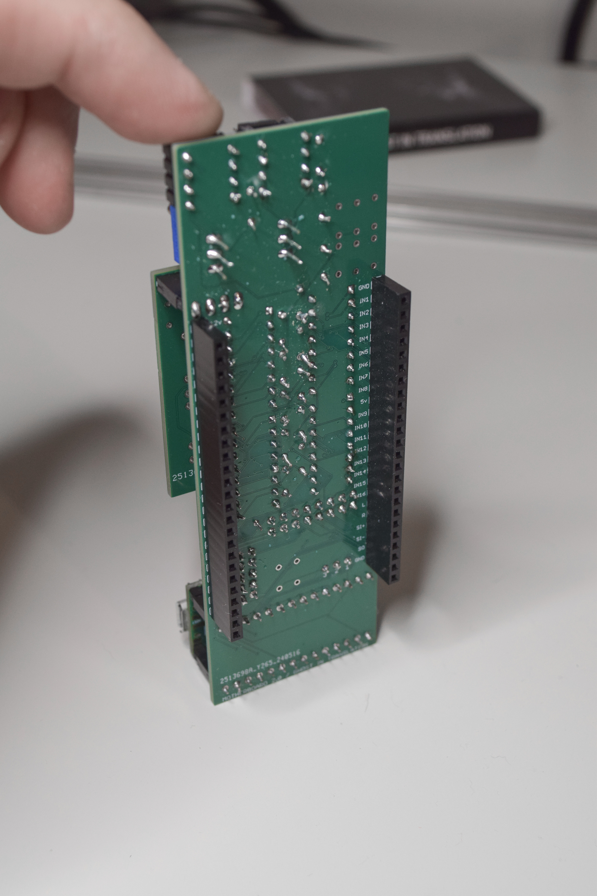
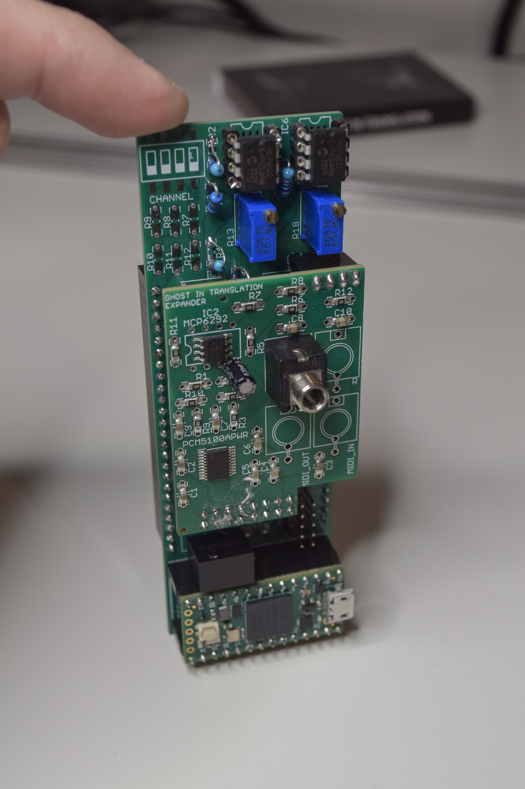

# MOTHERBOARD

Motherboard is a Eurorack and general modular synthesizers platform built around Teensy 4.0 that provides an easy way to build modules from a high level. 

The hardware consists of one PCB that allows to build modules as small as 8HP while the firmware consists of a collection of classes compatible with Teensy's audio library.

  

## Features

* 16 analog inputs (12 bits, 5v, 44.1kHz)
* 16 outputs (8bits Binary Code Modulation)
* 2 audio channels over I2S or 8 channels over TDM
* I2C to expand with analog outputs and more
* MIDI in and out
* Configurable via JSON over MIDI SysEx
* 10 pin Eurorack either way power
* Through hole and SMD for most footprints
* Teensy 4.0

## The idea

Wether analog or digital, often modules are designed from scratch as one-offs creations. This means going through the same challenges and solving them in slightly different ways. It’s possible to do better and not reinvent the wheel every time. 

By separating the functional circuitry from the user interface circuitry, a pattern will emerge and make it possible to reuse at least a few things. 

With analog it is more difficult to achieve as the circuit is very much dependent on the inputs and outputs, but it would still be possible to have a generic user interface connected to a specific functional circuit. 

With digital this gets interesting. The functional circuit can be completely generic and be reused for many modules, simply reading inputs and generating outputs, it doesn’t need to be designed around the final module. The low level code can be generic and reused too, while the high level code would be specific to each module.

## Instructions

See the hardware's and firmware's instructions under their respective folder.

## Known issues

- Actual inputs sampling frequency is reduced due to audible artifacts.

## TODO list

- Web editor to edit settings and maybe visualize data
- Use the CMSIS-DSP library to perform interpolation and filtering on the ADC readings?
- Auto calibration, does that require a digital potentiometer such as the MCP4651?
- Adding microSD card socket to store settings, MUC2 to move to pin 8?
- Adding an inverter chip to produce -5v out of the +5v to keep the board reliant only on +5v power but add capability of processing negative signals.
- Can Tx detect If MIDI or CLK type of signals
- How to Teletype I2C compatibility
- TDM input and output to send/receive 16 signals over one jack
- Explore replacement of Teensy for direct integration to the board by STM32F7, Pi Pico, Linux chip, FPGA chip,...

# About me
You can find me on Bandcamp, Instagram, Youtube:

https://ghostintranslation.bandcamp.com/

https://www.instagram.com/ghostintranslation/

https://www.youtube.com/ghostintranslation

# Support
To support my work:

https://www.patreon.com/ghostintranslation

https://www.paypal.com/paypalme/ghostintranslation

https://www.buymeacoffee.com/ghostintranslation

# License

This project is licensed under the MIT License - see the [LICENSE.md](LICENSE.md) file for details