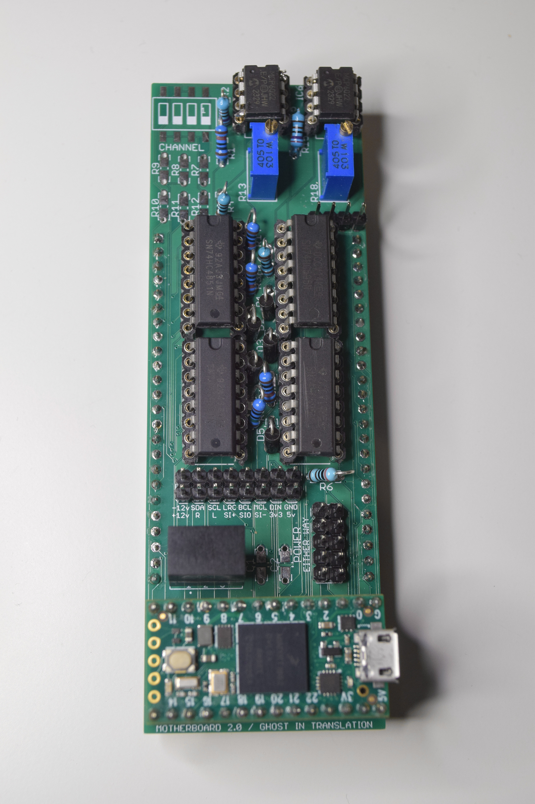
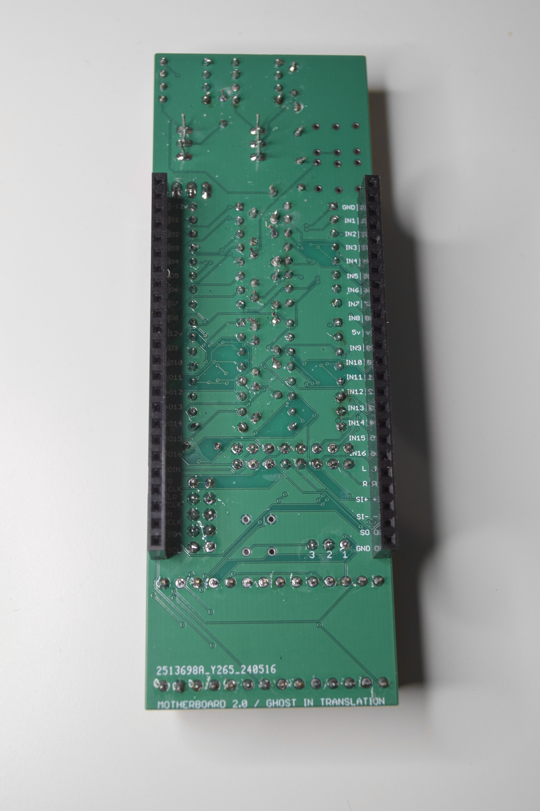
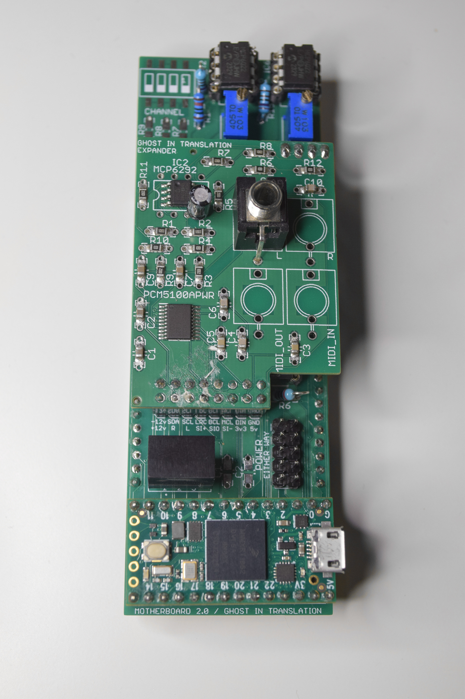

# Hardware

The PCB is made so that it is possible to use either through hole or SMD for most components.

  

## Bill Of Materials

```
4 x 10k resistor
4 x 2k resistor
3 x 1k resistor
2 x 2.7k resistor
1 x 8k resistor
1 x 157ohm resistor
2 x 10k trim potentiometer
4 x BAT43 diode
1 x 4148 diode
2 x SN74HC4851 multiplexer
2 x SN74HC595 shift register
2 x MCP6292 or MCP6022 op-amp
1 x 6N137S optocoupler
1 x MB1S bridge rectifier
1 x VX7805-500 DC-DC converter
1 x 10uf capacitor
1 x 22uf capacitor
1 x 4 DIP switches SMD
2 x 14 pins female header
2 x 24 pins female header
2 x 8 pins male header
2 x 5 pins male header
1 x 4 pins male header
```

An export of the BOM out of Eagle is available in this repo.

### Notes

Some parts could be replaced by other alternatives, consider the following:

- MCP6292/MCP6022
  - high slew rate,
  - single supply 0-5v
  - high bandwidth
  - Rail-to-Rail

- SN74HC4851
  - included inputs protection from voltages outside the supply range.

- BAT43
  - I only tried 2N4007 – *Be careful they protect the Teensy from frying in case of voltages outside 0-3.3v ± the forward voltage, which should not exceed 0.7v*

- VX7805-500 is obsolete and I haven't tried any replacement yet, potential candidates:
  - R-78CK5.0-0.5
  - R-78K5.0-0.5

If you don't wish to use MIDI you can omit:
- the optocoupler and its resistors and diode
- the dipswitch and its 4 resistors

Unless using I2C, which is not the case with barebone Motherboard and its audio expander, you can omit:
- the 2 pullup resistors R11 and R12

## Schematics

An export of the schematics out of Eagle is available in this repo.

### Notes

The op-amps, multiplexers, and shift registers are displayed twice in the schematics as if there were 2 sets of each but that is because one set is for through hole and one set is for SMD to have the choice. There is only 2 op-amps, 2 multiplexers and 2 shift registers.

## Audio-Midi expander

The Motherboard itself does not include any audio DAC, this is because of limited space and to reduce cost for modules that would not require audio. However an expander connector is there to provide the necessary for adding such feature.

I designed an audio-midi expander board that direcly attached on the back of the Motherboard. It provides 2 audio jacks and 2 MIDI jacks in the back to allow reducing clutter on the front, but the audio and MIDI signals are also available on the main headers to be passed to the front panels.

  

Simulation of the audio amplification circuit available [here](https://www.falstad.com/circuit/circuitjs.html?ctz=CQAgjCAMB0l3BWECAc0BsBOFCAsBmSTXMAdiOUmRAOQFMBaMMAKACUQGAmXK3FTlxQD+UcCC5xw0LtNxiYCFgENO6eepCbNApFTDx4E6AnhhcmUri6Z0kUpmNIDhlgHc180Q01VI7rXkqbSCWAHNOMCFwTFkmaMkBPxYAJ08aAXiRJPB4VMCC8w0g8FN8rJi4qIEisRc8tIraits6w38PH3kUKi7wXFDOzWbq-tCAY0FeDMjo0T9YQ0xlldW1xyZoMmt8UnxCBxR9hAgYOFZGnj5Mq-Bo-VcI7mnR5-0BhXyuBHQC79+wHY2nBwhIfuAgf8JJAcv5JrVhrECgt2us0StjOguGB8AhUKQbMQEKQjlBFqwAB4STD4O6yfDEO5IeQ8EAAQQArgATACWAHsADoAZz5HIALuxZgJWkwka0-DQqHoFCYAn0GN5NExfh0Cgx8LItfM1VrAelkh5Tb9fFAAla9QbbR4wEjNFDfCwqfrCCBSIIerkaBJ5AARNkAYU9kWYkVxpV6ONkLPkAGUeQA7MIAGzowqFHIADgWswBPYXKbn88sAWwL+SNmQbYkkIL5YhtvGW1DOkDAP2+zbE+BYbfMyJouKQekWWOcEn6IGHQA).

